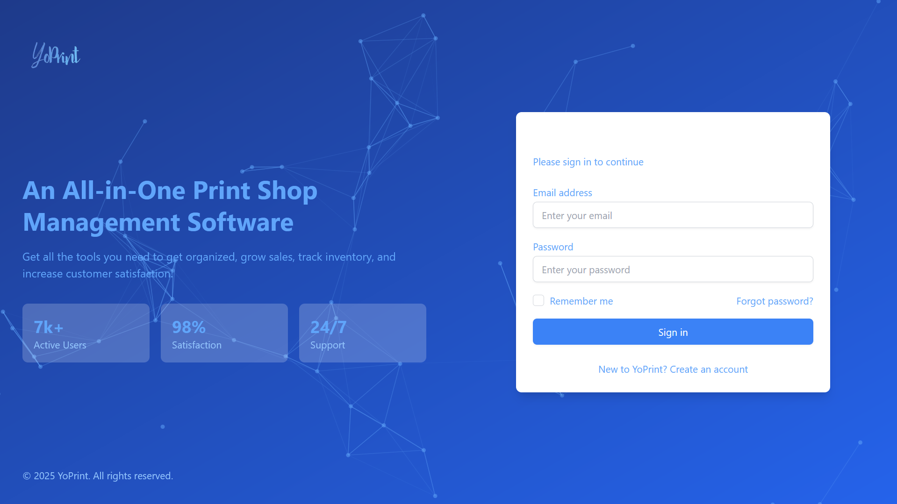
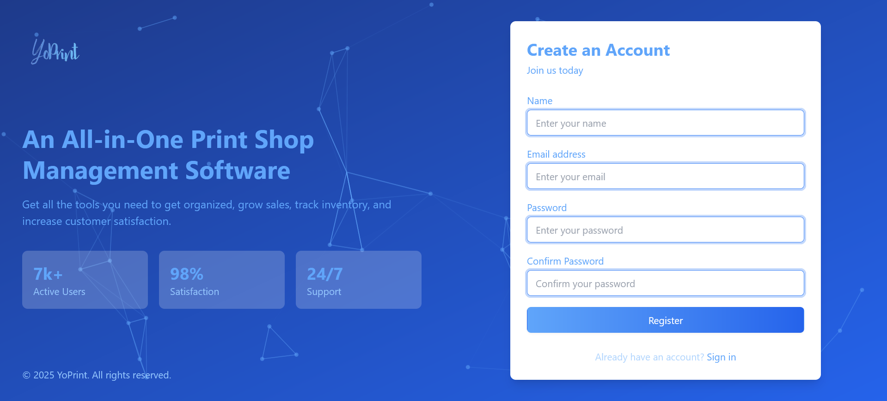
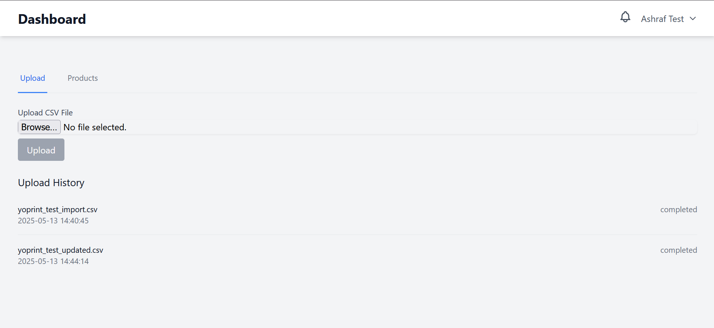
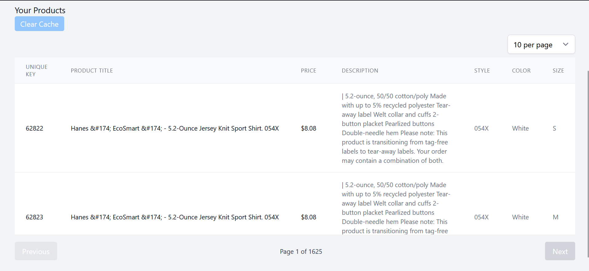

# 🚀 My Laravel + Vite Application

This is a Laravel application powered with Vite and includes queue workers, SQLite, and Reverb for real-time events.

## ⚙️ Technologies Used

✅ **Laravel Breeze** – Authentication scaffolding  
🔄 **WebSocket Reverb** – Real-time communication  
📬 **Predis** – Redis client for Laravel  
🧩 **Vue 3** – Reactive frontend framework  
📢 **Laravel Events** – Custom event broadcasting  
🎯 **Laravel Queue Jobs** – Background processing  
⚡ **Vite** – Lightning-fast frontend bundler  
🎨 **Tailwind CSS** – Utility-first CSS framework

---

## 📸 Screenshots
- **Watch Demo**  

> Here's a glimpse of the application UI:

- **Login Page**  
  

- **Register Page**  
  

- **Upload Page**  
  

- **Product Page**  
  

---

## 🛠️ Setup Instructions

Follow these steps to get the application up and running on your local machine.

## 1️⃣ Clone the repository
git clone https://github.com/nassar2024/Upload.git
cd Upload

## 🛠️ Set up .env file
cp .env.example .env
DB_CONNECTION=sqlite
DB_DATABASE=/absolute/path/to/database/database.sqlite

## install PHP dependencies
composer install

## Run database migrations
php artisan migrate

## install Node.js dependencies
npm install

## Build frontend assets
npm run start-all
Then in a new terminal, run:
php artisan queue:work

##  Serve the application
Or you Can Run Each Command By Its Own
php artisan serve
npm run build
npm run dev
php artisan reverb:start --debug
php artisan queue:work
